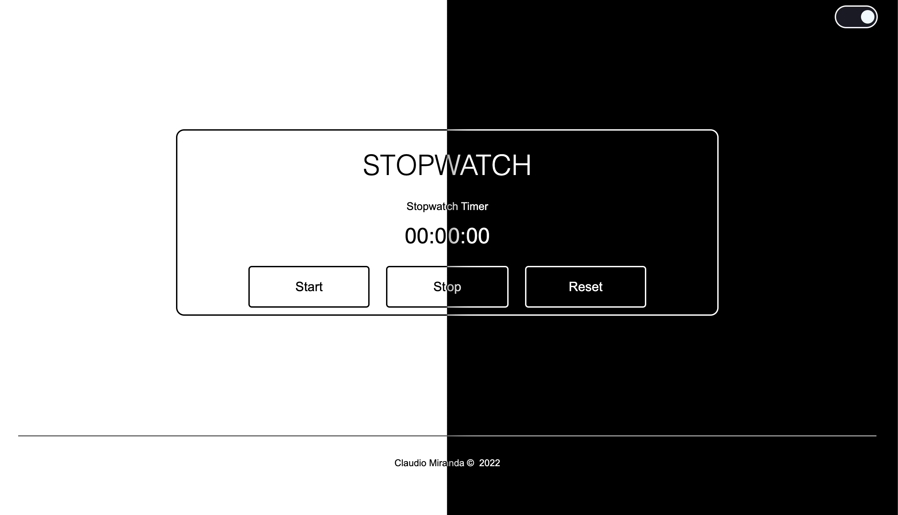

# Dark/light Mode - StopWatch

For this challenge, I wanted to implement a light and dark mode switch toggle that would change the colours or invert the colours from the default to dark mode for this basic stopwatch component. The method I used was creating variables for the two color states, and adding the toggle on those two throughout.

 

